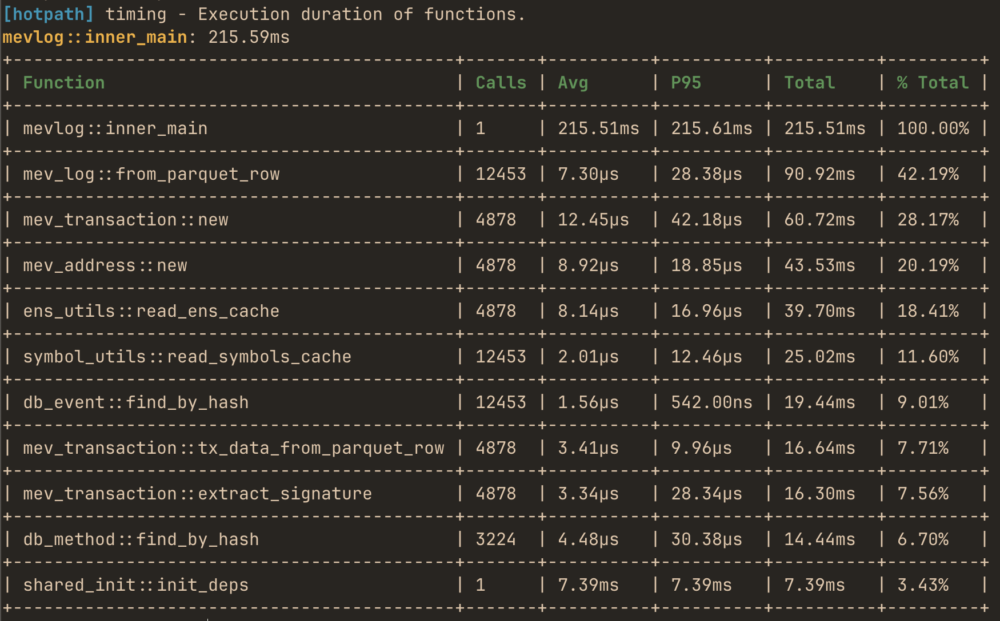
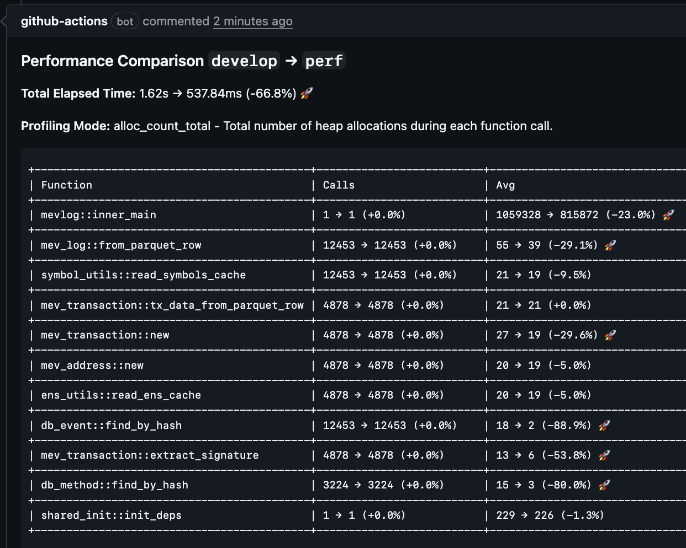
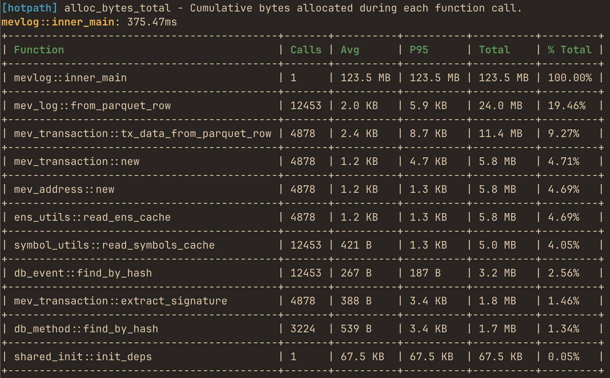

# hotpath - find and profile bottlenecks in Rust
[](https://crates.io/crates/hotpath) [](https://github.com/pawurb/hotpath/actions)

[](https://github.com/pawurb/mevlog-rs)

A lightweight, easy-to-configure Rust profiler that shows exactly where your code spends time and allocates memory. Instrument any function or code block to quickly spot bottlenecks, and focus your optimizations where they matter most.

In [this post](https://pawelurbanek.com/rust-optimize-performance), I explain the motivation behind the project and its inner workings.

## Features

- **Zero-cost when disabled** — fully gated by a feature flag.
- **Low-overhead** profiling for both sync and async code.
- **Memory allocation tracking** — track bytes allocated or allocation counts per function.
- **Detailed stats**: avg, total time, call count, % of total runtime, and configurable percentiles (p95, p99, etc.).
- **Background processing** for minimal profiling impact.
- **GitHub Actions integration** - configure CI to automatically benchmark your program against a base branch for each PR



See [hotpath-profile](https://github.com/pawurb/hotpath/blob/main/.github/workflows/hotpath-profile.yml) and [hotpath-comment](https://github.com/pawurb/hotpath/blob/main/.github/workflows/hotpath-comment.yml) for a sample config.

## Quick Start

> **⚠️ Note**  
> This README reflects the latest development on the `main` branch.
> For documentation matching the current release, see [crates.io](https://crates.io/crates/hotpath) — it stays in sync with the published crate.

Add to your `Cargo.toml`:

```toml
[dependencies]
hotpath = { version = "0.4", optional = true }

[features]
hotpath = ["dep:hotpath", "hotpath/hotpath"]
hotpath-alloc-bytes-total = ["hotpath/hotpath-alloc-bytes-total"]
hotpath-alloc-count-total = ["hotpath/hotpath-alloc-count-total"]
hotpath-alloc-self = ["hotpath/hotpath-alloc-self"]
hotpath-off = ["hotpath/hotpath-off"]
```

This config ensures that the lib has **zero** overhead unless explicitly enabled via a `hotpath` feature.

Profiling features are mutually exclusive. To ensure compatibility with `--all-features` setting, the crate defines an additional `hotpath-off` flag. This is handled automatically - you should never need to enable it manually.

## Usage

```rust
use std::time::Duration;

#[cfg_attr(feature = "hotpath", hotpath::measure)]
fn sync_function(sleep: u64) {
    std::thread::sleep(Duration::from_nanos(sleep));
}

#[cfg_attr(feature = "hotpath", hotpath::measure)]
async fn async_function(sleep: u64) {
    tokio::time::sleep(Duration::from_nanos(sleep)).await;
}

// When using with tokio, place the #[tokio::main] first
#[tokio::main]
// You can configure any percentile between 0 and 100
#[cfg_attr(feature = "hotpath", hotpath::main(percentiles = [99]))]
async fn main() {
    for i in 0..100 {
        // Measured functions will automatically send metrics
        sync_function(i);
        async_function(i * 2).await;

        // Measure code blocks with static labels
        #[cfg(feature = "hotpath")]
        hotpath::measure_block!("custom_block", {
            std::thread::sleep(Duration::from_nanos(i * 3))
        });
    }
}
```

Run your program with a `hotpath` feature:

```
cargo run --features=hotpath
```

Output:

```
[hotpath] Performance summary from basic::main (Total time: 122.13ms):
+-----------------------+-------+---------+---------+----------+---------+
| Function              | Calls | Avg     | P99     | Total    | % Total |
+-----------------------+-------+---------+---------+----------+---------+
| basic::async_function | 100   | 1.16ms  | 1.20ms  | 116.03ms | 95.01%  |
+-----------------------+-------+---------+---------+----------+---------+
| custom_block          | 100   | 17.09µs | 39.55µs | 1.71ms   | 1.40%   |
+-----------------------+-------+---------+---------+----------+---------+
| basic::sync_function  | 100   | 16.99µs | 35.42µs | 1.70ms   | 1.39%   |
+-----------------------+-------+---------+---------+----------+---------+
```

## Allocation Tracking

In addition to time-based profiling, `hotpath` can track memory allocations. This feature uses a custom global allocator from [allocation-counter crate](https://github.com/fornwall/allocation-counter) to intercept all memory allocations and provides detailed statistics about memory usage per function.

Available alloc profiling modes:

- `hotpath-alloc-bytes-total` - Tracks total bytes allocated during each function call
- `hotpath-alloc-count-total` - Tracks total number of allocations per function call

By default, allocation tracking is **cumulative**, meaning that a function's allocation count includes all allocations made by functions it calls (nested calls). Notably, it produces invalid results for recursive functions. To track only **exclusive** allocations (direct allocations made by each function, excluding nested calls), enable the `hotpath-alloc-self` feature flag in combination with an allocation profiling mode.

Run your program with a selected flag to print a similar report:

```
cargo run --features='hotpath,hotpath-alloc-bytes-total'
```



### Profiling memory allocations for async functions

To profile memory usage of `async` functions you have to use a similar config:

```rust
#[cfg(any(
    feature = "hotpath-alloc-bytes-total",
    feature = "hotpath-alloc-count-total",
))]
#[tokio::main(flavor = "current_thread")]
async fn main() {
    _ = inner_main().await;
}

#[cfg(not(any(
    feature = "hotpath-alloc-bytes-total",
    feature = "hotpath-alloc-count-total",
)))]
#[tokio::main]
async fn main() {
    _ = inner_main().await;
}

#[cfg_attr(feature = "hotpath", hotpath::main)]
async fn inner_main() {
    // ...
}
```

It ensures that tokio runs in a `current_thread` runtime mode if any of the allocation profiling flags is enabled.

**Why this limitation exists**: The allocation tracking uses thread-local storage to track memory usage. In multi-threaded runtimes, async tasks can migrate between threads, making it impossible to accurately attribute allocations to specific function calls.

## How It Works

1. `#[cfg_attr(feature = "hotpath", hotpath::main)]` - Macro that initializes the background measurement processing
2. `#[cfg_attr(feature = "hotpath", hotpath::measure)]` - Macro that wraps functions with profiling code
3. **Background thread** - Measurements are sent to a dedicated worker thread via bounded channel
4. **Statistics aggregation** - Worker thread maintains running statistics for each function/code block
5. **Automatic reporting** - Performance summary displayed when the program exits

## API

### Macros

#### `#[hotpath::main]`

Attribute macro that initializes the background measurement processing when applied. Supports parameters:
- `percentiles = [50, 95, 99]` - Custom percentiles to display
- `format = "json"` - Output format ("table", "json", "json-pretty")
- `limit = 20` - Maximum number of functions to display (default: 15, 0 = show all)

#### `#[hotpath::measure]`

An opt-in attribute macro that instruments functions to send timing measurements to the background processor.

#### `#[hotpath::measure_all]`

An attribute macro that applies `#[measure]` to all functions in a `mod` or `impl` block. Useful for bulk instrumentation without annotating each function individually. Can be used on:
- **Inline module declarations** - Instruments all functions within the module
- **Impl blocks** - Instruments all methods in the implementation

Example:

```rust
// Measure all methods in an impl block
#[cfg_attr(feature = "hotpath", hotpath::measure_all)]
impl Calculator {
    fn add(&self, a: u64, b: u64) -> u64 { a + b }
    fn multiply(&self, a: u64, b: u64) -> u64 { a * b }
    async fn async_compute(&self) -> u64 { /* ... */ }
}

// Measure all functions in a module
#[cfg_attr(feature = "hotpath", hotpath::measure_all)]
mod math_operations {
    pub fn complex_calculation(x: f64) -> f64 { /* ... */ }
    pub async fn fetch_data() -> Vec<u8> { /* ... */ }
}
```

> **Note:** Once Rust stabilizes [`#![feature(proc_macro_hygiene)]`](https://doc.rust-lang.org/beta/unstable-book/language-features/proc-macro-hygiene.html?highlight=proc_macro_hygiene#proc_macro_hygiene) and [`#![feature(custom_inner_attributes)]`](https://doc.rust-lang.org/beta/unstable-book/language-features/custom-inner-attributes.html), it will be possible to use `#![measure_all]` as an inner attribute directly inside module files (e.g., at the top of `math_operations.rs`) to automatically instrument all functions in that module.

#### `#[hotpath::skip]`

A marker attribute that excludes specific functions from instrumentation when used within a module or impl block annotated with `#[measure_all]`. The function executes normally but doesn't send measurements to the profiling system.

Example:

```rust
#[cfg_attr(feature = "hotpath", hotpath::measure_all)]
mod operations {
    pub fn important_function() { /* ... */ } // Measured

    #[cfg_attr(feature = "hotpath", hotpath::skip)]
    pub fn not_so_important_function() { /* ... */ } // NOT measured
}
```

#### `hotpath::measure_block!(label, expr)`

Macro that measures the execution time of a code block with a static string label.

### GuardBuilder API

`hotpath::GuardBuilder::new(caller_name)` - Create a new builder with the specified caller name

**Configuration methods:**
- `.percentiles(&[u8])` - Set custom percentiles to display (default: [95])
- `.format(Format)` - Set output format (Table, Json, JsonPretty)
- `.limit(usize)` - Set maximum number of functions to display (default: 15, 0 = show all)
- `.reporter(Box<dyn Reporter>)` - Set custom reporter (overrides format)
- `.build()` - Build and return the HotPath guard

**Example:**
```rust
let _guard = hotpath::GuardBuilder::new("main")
    .percentiles(&[50, 90, 95, 99])
    .limit(20)
    .format(hotpath::Format::JsonPretty)
    .build();
```

## Usage Patterns

### Using `hotpath::main` macro vs `GuardBuilder` API

The `#[hotpath::main]` macro is convenient for most use cases, but the `GuardBuilder` API provides more control over when profiling starts and stops.

Key differences:

- **`#[hotpath::main]`** - Automatic initialization and cleanup, report printed at program exit
- **`let _guard = GuardBuilder::new("name").build()`** - Manual control, report printed when guard is dropped, so you can fine-tune the measured scope.

Only one hotpath guard may be alive at a time, regardless of whether it was created by the `main` macro or by the builder API. If a second guard is created, the library will panic.

#### Using `GuardBuilder` for more control

```rust
use std::time::Duration;

#[cfg_attr(feature = "hotpath", hotpath::measure)]
fn example_function() {
    std::thread::sleep(Duration::from_millis(10));
}

fn main() {
    #[cfg(feature = "hotpath")]
    let _guard = hotpath::GuardBuilder::new("my_program")
        .percentiles(&[50, 95, 99])
        .format(hotpath::Format::Table)
        .build();

    example_function();

    // This will print the report.
    #[cfg(feature = "hotpath")]
    drop(_guard);

    // Immediate exit (no drops); `#[hotpath::main]` wouldn't print.
    std::process::exit(1);
}
```

#### Using in unit tests

In unit tests you can profile each individual test case:

```rust
#[cfg(test)]
mod tests {
    use super::*;

    #[test]
    fn test_sync_function() {
        #[cfg(feature = "hotpath")]
        let _hotpath = hotpath::GuardBuilder::new("test_sync_function")
            .percentiles(&[50, 90, 95])
            .format(hotpath::Format::Table)
            .build();
        sync_function();
    }

    #[tokio::test(flavor = "current_thread")]
    async fn test_async_function() {
        #[cfg(feature = "hotpath")]
        let _hotpath = hotpath::GuardBuilder::new("test_async_function")
            .percentiles(&[50, 90, 95])
            .format(hotpath::Format::Table)
            .build();

        async_function().await;
    }
}
```

Run tests with profiling enabled:

```bash
cargo test --features hotpath -- --test-threads=1
```

Note: Use `--test-threads=1` to ensure tests run sequentially, as only one hotpath guard can be active at a time.

### Percentiles Support

By default, `hotpath` displays P95 percentile in the performance summary. You can customize which percentiles to display using the `percentiles` parameter:

```rust
#[tokio::main]
#[cfg_attr(feature = "hotpath", hotpath::main(percentiles = [50, 75, 90, 95, 99]))]
async fn main() {
    // Your code here
}
```

For multiple measurements of the same function or code block, percentiles help identify performance distribution patterns. You can use percentile 0 to display min value and 100 to display max.

### Output Formats

By default, `hotpath` displays results in a human-readable table format. You can also output results in JSON format for programmatic processing:

```rust
#[tokio::main]
#[cfg_attr(feature = "hotpath", hotpath::main(format = "json-pretty"))]
async fn main() {
    // Your code here
}
```

Supported format options:
- `"table"` (default) - Human-readable table format
- `"json"` - Compact, oneline JSON format
- `"json-pretty"` - Pretty-printed JSON format

Example JSON output:

```json
{
  "hotpath_profiling_mode": "timing",
  "output": {
    "basic::async_function": {
      "calls": "100",
      "avg": "1.16ms",
      "p95": "1.26ms",
      "total": "116.41ms",
      "percent_total": "96.18%"
    },
    "basic::sync_function": {
      "calls": "100",
      "avg": "23.10µs",
      "p95": "37.89µs",
      "total": "2.31ms",
      "percent_total": "1.87%"
    }
  }
}
```

You can combine multiple parameters:

```rust
#[cfg_attr(feature = "hotpath", hotpath::main(percentiles = [50, 90, 99], format = "json", limit = 10))]
```

## Custom Reporters

You can implement your own reporting to control how profiling results are handled. This allows you to plug `hotpath` into existing tools like loggers, CI pipelines, or monitoring systems.

For complete working examples, see:
- [`examples/csv_file_reporter.rs`](crates/hotpath-test-tokio-async/examples/csv_file_reporter.rs) - Save metrics to CSV file
- [`examples/json_file_reporter.rs`](crates/hotpath-test-tokio-async/examples/json_file_reporter.rs) - Save metrics to JSON file
- [`examples/tracing_reporter.rs`](crates/hotpath-test-tokio-async/examples/tracing_reporter.rs) - Log metrics using the tracing crate 

## Benchmarking

Measure overhead of profiling 10k method calls with [hyperfine](https://github.com/sharkdp/hyperfine):

Timing:
```
cargo build --example benchmark --features hotpath --release
hyperfine --warmup 3 './target/release/examples/benchmark'
```

Allocations:
```
cargo build --example benchmark --features='hotpath,hotpath-alloc-count-total' --release
hyperfine --warmup 3 './target/release/examples/benchmark'
```
